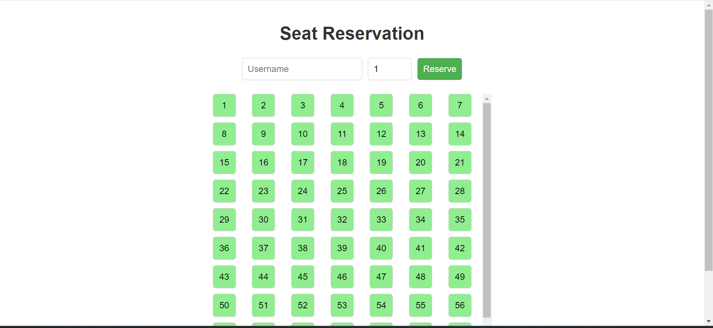
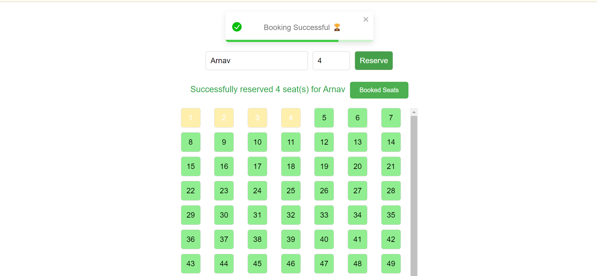
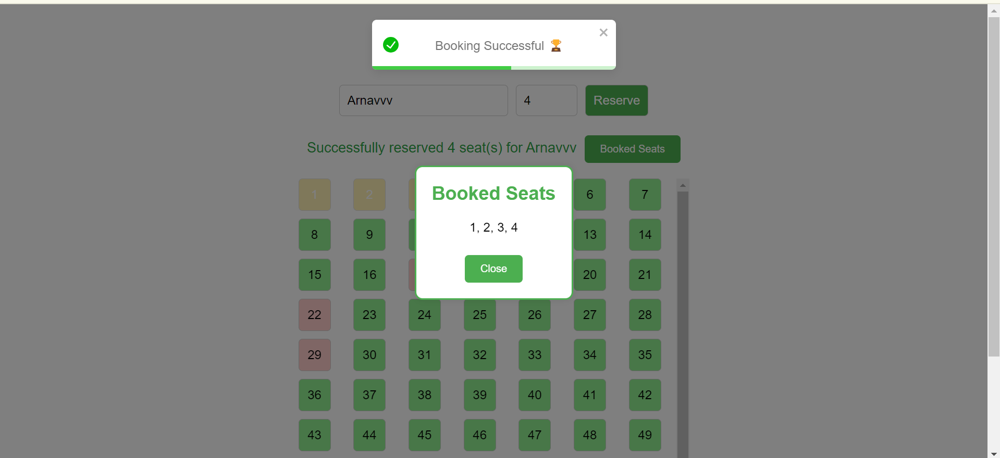
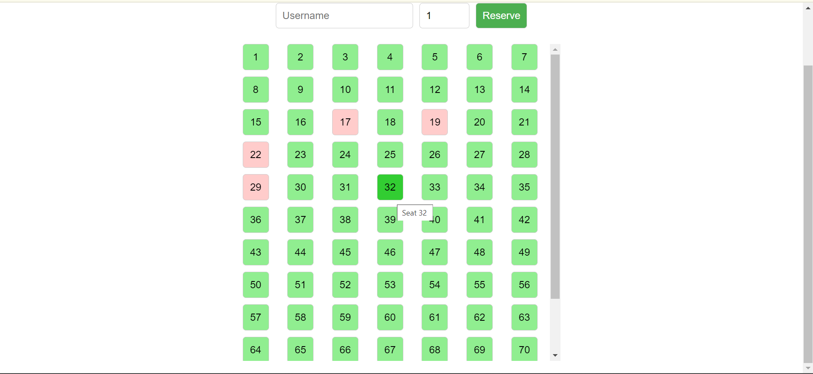

# Seat Reservation System

---

## Overview

The Seat Reservation System is a web-based application that allows users to reserve seats in a coach. It features a dynamic seat map where users can see the current status of each seat, enter their username, specify the number of seats they want to reserve, and make reservations. The application provides immediate feedback on the booking status through toast notifications and highlights the reserved seats for better user experience. Additionally, the system includes APIs for booking all seats, emptying all seats, and partially filling the desired number of seats randomly.

## Features

- **Dynamic Seat Map**: Displays the current status of each seat.
- **User Input**: Users can enter their username and the number of seats they want to reserve.
- **Reservation Logic**: The system processes the reservation request and updates the seat map accordingly.
- **APIs**: 
  - **Book All Seats**: An endpoint to reserve all seats at once.
  - **Empty All Seats**: An endpoint to empty all reserved seats.
  - **Partially Fill Seats**: An endpoint to reserve a specified number of seats randomly.
- **Toast Notifications**: Provides immediate feedback on the reservation status.
- **Popup for Booked Seats**: Displays a list of recently booked seats in a popup window.
- **Scroll to Reserved Seats**: Automatically scrolls to the first booked seat for better visibility using the `useRef` hook.
- **Input Validation**: Ensures users enter a valid username and handles cases where no seats are available.
- **Highlighting**: Highlights recently booked seats for 6.5 seconds.
- **Disable Inputs During Processing**: Prevents users from making multiple requests simultaneously by disabling inputs during the reservation process.
- **Nearby Seat Assignment**: Tries to assign seats nearby for the same user if booking multiple seats.

## Edge Cases Handled

1. **Empty Username**: The system checks if the username field is empty and shows an error toast notification if it is.
2. **Invalid Number of Seats**: The input for the number of seats is limited between 1 and 7.
3. **No Available Seats**: If there are no seats available or the reservation request fails, an appropriate error message is displayed.
4. **Server Errors**: Handles and displays server error messages appropriately.
5. **Button Disable During Processing**: Inputs and the reserve button are disabled for 6.5 seconds during the reservation process to prevent multiple submissions.
6. **Popup Visibility**: The "Booked Seats" button is only shown when seats have been successfully booked.

## Installation

1. Clone the repository:
   ```bash
   git clone https://github.com/your-username/seat-reservation-system.git
   ```
2. Navigate to the project directory:
   ```bash
   cd seat-reservation-system
   ```
3. Install the dependencies:
   ```bash
   npm install
   ```

## Running the Application

1. Start the development server:
   ```bash
   npm start
   ```
2. Open your browser and navigate to `http://localhost:3000`.

## Code Structure

- **components/Seat.js**: Main component handling the seat reservation logic.
- **Seat.css**: CSS file for styling the seat map and other UI elements.

## Usage

1. Enter your username in the input field.
2. Specify the number of seats you want to reserve (between 1 and 7).
3. Click the "Reserve" button to make a reservation.
4. If the reservation is successful, the reserved seats will be highlighted, and a success message will be displayed.
5. Click the "Booked Seats" button to see a popup with a list of recently booked seats.

## APIs

- **Book All Seats**: Reserves all seats at once.
- **Empty All Seats**: Empties all reserved seats.
- **Partially Fill Seats**: Reserves a specified number of seats randomly.

## Dependencies

- **React**: For building the user interface.
- **axios**: For making HTTP requests.
- **react-toastify**: For displaying toast notifications.
- **react-toastify/dist/ReactToastify.css**: Toast notification styles.

## Screenshots

### Main Screen


### Toast with invalid request


### Successful booking


### Booked Seats Dialog Box


### Initially randomly booked Seats

